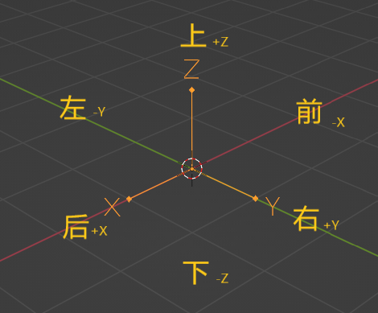

 >1.什么是READOUT？
   * IR使用对象名来区分组件，这些对象名中可被识别的语素即为READOUT。
   * 如对于车架，`FRAME`为其对应的READOUT，这意味着其对象名称至少应包含`FRAME`。
      
   * 包含相同READOUT的对象被IR认为是同一组件。
     * 比如，对于READOUT为`BOGEY_FRONT_WHEEL_[num]`的组件，`BOGEY_FRONT_WHEEL_1`和`BOGEY_FRONT_WHEEL_2`会被认为是两个组件，但`BOGEY_FRONT_WHEEL_1_1`和`BOGEY_FRONT_WHEEL_1_2`会被认为是同一组件
   * READOUT是无序的。
   * 除READOUT外的字符均可自定义。 
   * 下文约定：
     - `[pos]`表示前/后(FRONT或REAR)，**这是对应READOUT的一部分。**
     - `[side]`表示左/右(LEFT或RIGHT)，**这是对应READOUT的一部分。**
     - `[num]`表示任意不与其他同类物体重复的数字，**这是对应READOUT的一部分。**

 >2.我该使用什么软件？
   * 我们通常使用blender为IR制作模型。
     * 导出模型时，为了正确显示动画，应使用`Wavefront(.obj)(legacy)`模式，且只勾选OBJ物体。
        
     
       !>注意，Metasequoia无法为obj模型导出对象数据，不可用于IR追加包制作。
   * 贴图可使用Paint.net等。
   * 音效可使用Adobe Audition**（付费）**等。
   * JSON可使用VS Code等。

 >3.在blender中建模有什么注意事项吗？
  * 在blender中，IR以-X方向为前，+Z方向为上，-Y方向为左，就像这样

    
  * blender中1m即为Minecraft中的一格
  * blender中，铁轨轨面/车辆轮缘的高度应为Z=0
    >RTM则为Z=-1